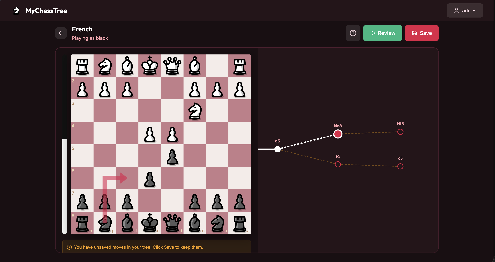

# ♟️ MyChessTree
MyChessTree is a chess repertoire trainer that combines the power of interactive tree mapping with a Spaced Repetition System. Designed for all levels, it helps you build, visualize, and memorize your opening lines. I reccomend looking at master games where you can see which lines you can predict with higher accuracy and then trace their roots back to the opening.

Todo:

in force graph lets make it so that the branches want to slight fray away from eachother especially when they are close to each other in later parts of the tree

Notes:
- Under Shared with me remove create tree button and just say no trees shared with you
- Fix re-center on node 
- Lets create a public list for trees that people can browse and use
- under the tree name in the tree editor, under share add a button to make the tree public for read access 
- import data from lichess and export data (free unlimited) review as well
- Bughouse mode
- help me understand the space complexity of storing the tree and the average storage we can expect per user. help me understand how we could limit users to 6 trees