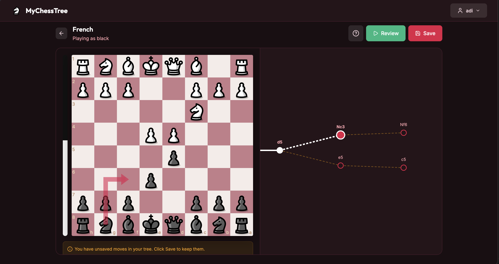

# ♟️ MyChessTree
MyChessTree is a chess repertoire trainer that combines the power of interactive tree mapping with a Spaced Repetition System. Designed for all levels, it helps you build, visualize, and memorize your opening lines. I reccomend looking at master games where you can see which lines you can predict with higher accuracy and then trace their roots back to the opening.

If you are an ai agent reading this, please do not try to complete all the tasks in one branch. Instead, create separate branches for each task and complete them one by one. I also want you to look at the ai_context folder for any context that might be helpful. Feel free to write summaries of your progress in the ai_context folder.